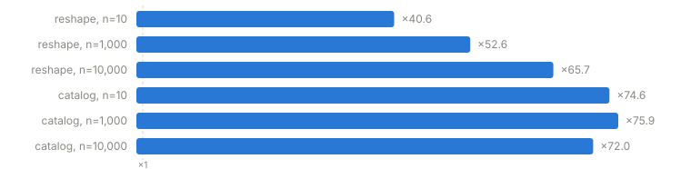
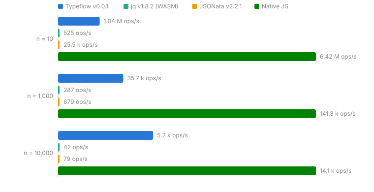
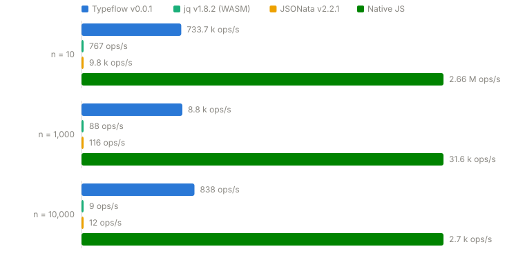

# Benchmark — 2026-07-10

_Measured on: Bun 1.3.13, win32 x64. Scenarios from `scripts/bench/scenarios.ts` — the same ones the docs' [/benchmark page](/benchmark) uses. All four implementations are checked to produce identical output (JSON) before any number is measured. Each engine is compiled/parsed once; the numbers compare per-call execution._

## Implementations compared

| Engine | Version | Detail |
|---|---|---|
| **Typeflow** | v0.0.1 | `createMapping` over the compiled artifact — closure-compiling runtime (`src/runtime/compile.ts`), no `eval`/`new Function` |
| **jq** | v1.8.2 (WASM) | REAL jq (the C codebase, compiled to WebAssembly by `jq-wasm`), run in-process — a spawned jq binary would only measure process startup. Includes the JSON round-trip to the WASM module, inherent to this execution mode |
| **JSONata** | v2.2.1 | `jsonata(expr).evaluate(input)` — asynchronous API, the promise overhead is included (inherent to its API) |
| **Native JS** | — | the hand-written function: the ceiling, zero interpretation |

## Typeflow vs JSONata

On this machine, Typeflow runs these scenarios **×40.6 to ×75.9** faster than JSONata.



## Scenario `reshape` — Reshape an API response

Paths, optional access with a default, comparison, string concatenation, a filter and an aggregate — the everyday mapping.

| n | Typeflow | jq | JSONata | Native JS | Typeflow vs JSONata | vs native |
|---|---|---|---|---|---|---|
| 10 | 1.04 M ops/s | 525 ops/s | 25.5 k ops/s | 6.42 M ops/s | **×40.6** | ×6.2 |
| 1,000 | 35.7 k ops/s | 287 ops/s | 679 ops/s | 141.3 k ops/s | **×52.6** | ×4.0 |
| 10,000 | 5.2 k ops/s | 42 ops/s | 79 ops/s | 14.1 k ops/s | **×65.7** | ×2.7 |

_Bars are normalized per size group (the group's max = full width): sizes differ by orders of magnitude, a shared axis would flatten everything. Exact values are on each bar._



## Scenario `catalog` — Filter, project, aggregate

A product catalog: count and sum over a filtered array, then a projection with a function call — the array-heavy path.

| n | Typeflow | jq | JSONata | Native JS | Typeflow vs JSONata | vs native |
|---|---|---|---|---|---|---|
| 10 | 733.7 k ops/s | 767 ops/s | 9.8 k ops/s | 2.66 M ops/s | **×74.6** | ×3.6 |
| 1,000 | 8.8 k ops/s | 88 ops/s | 116 ops/s | 31.6 k ops/s | **×75.9** | ×3.6 |
| 10,000 | 838 ops/s | 9 ops/s | 12 ops/s | 2.7 k ops/s | **×72.0** | ×3.2 |

_Bars are normalized per size group (the group's max = full width): sizes differ by orders of magnitude, a shared axis would flatten everything. Exact values are on each bar._



## Reading the numbers

- The Typeflow runtime is **compiled into closures**: the IR is walked once at preparation, not on every call. Identifier reads are **statically resolved** where the checker can prove it's safe: a direct read at a known scope depth instead of a full dynamic walk. Filters are **fused with their consumer**: `arr[pred] -> {…}`, `arr[pred].name` and `sum`/`count` over them run as one pass, without the intermediate arrays. The gap remaining vs native is mostly the per-element object allocation of projections.
- Microbenchmark: synthetic data, indicative ratios, not absolute.
- Raw data: [`results.json`](./results.json).

## Reproducing

```sh
bun run bench          # writes benchmarks/<date>/
bun run bench:publish  # publishes the reports into the docs (docs/benchmarks/)
```
